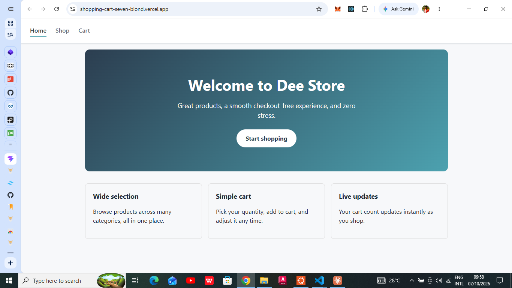
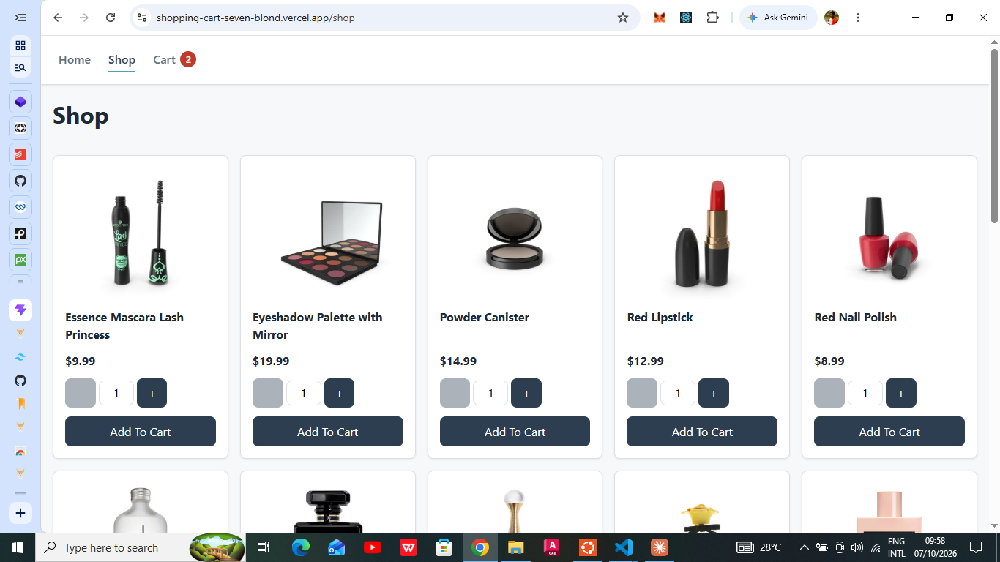
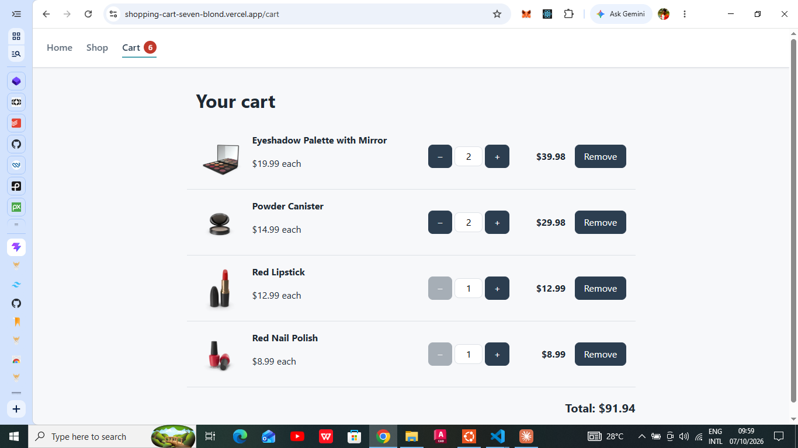

# Shopping Cart

A mock e-commerce app built with React. Browse products, choose quantities, and manage a shopping cart. There is no checkout or payment.

**Live demo:** [Shopping Cart](https://shopping-cart-seven-blond.vercel.app/)
<br><br>

<br><br>

<br><br>


## Features

- Three pages (Home, Shop, Cart) with a navbar shown on every page
- Products fetched from the [DummyJSON](https://dummyjson.com) API, with loading and error states
- Quantity input on each product card, with increment and decrement buttons and manual typing
- Cart count badge in the navbar that updates in real time
- Cart page where quantities can be changed, items removed, and the total is calculated
- Responsive layout for phones, tablets, and desktops
- Accessible markup: semantic elements, ARIA labels, and keyboard-friendly controls

## Tech Stack

- [React](https://react.dev/) with [Vite](https://vitejs.dev/)
- [React Router](https://reactrouter.com/) for routing
- Context API with `useReducer` for cart state
- CSS Modules for styling
- [Vitest](https://vitest.dev/) and [React Testing Library](https://testing-library.com/docs/react-testing-library/intro/) for testing
- Deployed on [Vercel](https://vercel.com/)

## Getting Started

**Prerequisites:** Node.js 18 or newer.

```bash
# Clone the repository
git clone https://github.com/Dee-pack/shopping-cart.git
cd shopping-cart

# Install dependencies
npm install

# Start the development server
npm run dev
```

Then open the URL printed in the terminal (usually `http://localhost:5173`).

## Scripts

| Command           | Description                         |
| ----------------- | ----------------------------------- |
| `npm run dev`     | Start the development server        |
| `npm run build`   | Create a production build in `dist` |
| `npm run preview` | Preview the production build        |
| `npm test`        | Run the test suite with Vitest      |

## Project Structure

```
src/
├── components/   # Reusable UI: Navbar, ProductCard, QuantityInput, CartItem, Loader, ErrorMessage
├── context/      # Cart state: reducer, provider, and useCart hook
├── hooks/        # useProducts: fetches and normalizes product data
├── pages/        # Home, Shop, and Cart pages
└── test/         # Test setup
```

Each component and page keeps its CSS Module and test file next to it.

## Design Notes

- **Cart state** lives in a pure reducer (`cartReducer.js`), which keeps the logic easy to unit test. The provider exposes `items`, `totalQuantity`, `totalPrice`, and the actions `addItem`, `setQuantity`, and `removeItem`.
- **The navbar badge** is derived from the cart items rather than stored separately, so it can never go out of sync.
- **`QuantityInput`** is a controlled component shared by the Shop and Cart pages. It allows an empty field while typing, ignores non-numeric input, and clamps values to a valid range.
- **API access** is isolated in `useProducts`, which maps the API response to `{ id, title, price, image }`. Switching to a different API only requires changing that one hook.

## Testing

```bash
npm test
```

Tests cover the cart reducer, the `useProducts` hook (with `fetch` mocked), and the main components and pages. They query elements by role and label, the way a user would find them. React Router itself is not tested; components that use it are wrapped in a `MemoryRouter`.

## Deployment

The app is deployed on Vercel. The `vercel.json` file at the project root rewrites all routes to `index.html` so React Router can handle direct visits and refreshes on `/shop` and `/cart`.

## Known Limitations

- The cart is kept in memory only, so it resets when the page is refreshed.
- Product data comes from a free public API and may change or be unavailable.

## Acknowledgements

- [DummyJSON](https://dummyjson.com) for the product data
